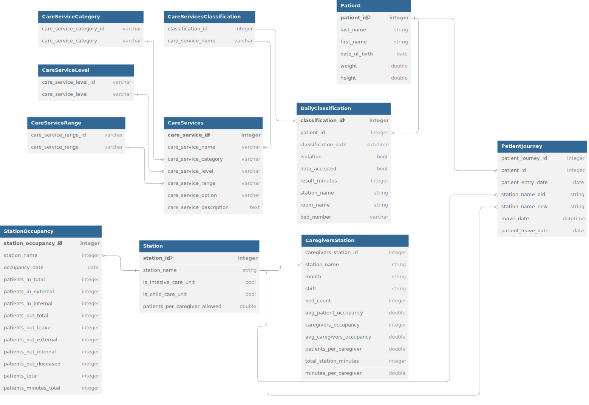

# Medical Staff Patient Care Assessment
This app helps nurses evaluate and document the time spent on patient care in accordance with the PPBV ("Pflegepersonalbemessungsverordnung").

## Getting Started

### Prerequisites
Please install Python, we recommend version `3.12`.

### Install packages

_If you will only use the Django app in the provided docker container you can skip this step. Although you might need it later for development._

We recommend using a virtual environment to manage the packages. 

Create a virtual environment with:

```shell
python -m venv /path/to/new/virtual/environment
```

IDEs like PyCharm also offer built in management for venv.

If you run into errors, please refer to the [venv documentation](https://docs.python.org/3/library/venv.html).

After activating your virtual environment, please run the following command from the project root to install the required packages.

```shell
pip install -r requirements.txt
```

### Environment Variables

This django project requires multiple environment variables. These variables should be set in an `.env` file. You can choose to use the default SQLite database for development by removing the `DB_HOST` variable.


```dosini
# Admin credentials for the admin route
DJANGO_SUPERUSER_PASSWORD=password
DJANGO_SUPERUSER_USERNAME =admin
DJANGO_SUPERUSER_EMAIL=''

# Database credentials
DB_NAME=medical-staff-assessment
DB_USER=postgres
DB_PASSWORD=mypassword
DB_PORT=5432
DB_HOST=db

# Web port
WEB_PORT=8000
NEXT_PUBLIC_API_URL=http://localhost/api
```

### Modes of Development

There are multiple options for development. 

1. We provide an `docker-compose.yml`, which runs a Postgres database and also runs the Django app in a container. This is the **recommended** way for working on that project. All changes are mapped into the container via a volume mount. The provided Dockerfile also creates a superuser automatically and handles existing migrations.
2. You can also only run the Postgres Database in a standalone container and run the Django app locally. Please adapt your `.env` file accordingly (set the `DB_HOST` and other parameters). After that refer to the setup in the [Running Django locally section](#running-django-locally). 
3. You can run the Django app locally with an SQLite database. Therefore, remove the `DB_HOST` variable from your `.env` file and follow the steps in the[Running Django locally section](#running-django-locally).


### Running Django locally

To run the Django project locally please execute the following commands. Please activate your virtual environment if you are using one.

```shell
python manage.py makemigrations
python manage.py migrate
python manage.py runserver
```

#### Creating a superuser if needed

To access the admin page under `http://localhost:8000/admin` you have to create an admin user:

```shell
python manage.py createsuperuser
```

### Loading example data

The example data is loaded with the following command. Please make sure that your database is running and you are in the correct venv.

```shell
python manage.py loaddata "./example_data/all_data.json"
```


### Running Docker
If you want to use the provided `docker-compose.yml`, please follow this section.

Before running the following commands, install [Docker](https://www.docker.com/).
Also create the .env file (see Section [Environment Variables](#environment-variables) for required fields).

```shell
docker compose build
docker compose up
```

## Linting

We use flake for linting. Run it with

```shell
flake8 .
```

Flake will also run on the pipeline if you push your code to GitHub.

If you use a virtual environment, run `flake8` from the `Scripts` folder in the `venv` folder.

## Contributing

### Issues

New Issues can be created to depict new tasks or bugs. Each issue should have its general topic in square brackets. After that you can type in your title. Please also add a meaningful description as well as labels and a milestone.
If you want to work on a specific topic/problem, please first pick or create a corresponding issue and assign that issue to you, so that there are no overlapping commits. Additionally please create a development branch for that issue with the _Create a branch_ button on the issue page.

### Pull Requests

To make your work available in production, you have to create a pull request from your feature branch into main. Additionally at least one reviewer is required, preferably someone who has not worked on the feature.
After merging your branch into main, please delete your feature branch.

### Code Quality Guidelines

To maintain a high standard of code quality in this project, we adhere to the following principles:

1. **Avoid Duplicate Code**  
   Reuse functions wherever possible to reduce redundancy and improve maintainability.

2. **Eliminate Dead Code**  
   Remove any unused code to keep the codebase clean and focused.

3. **Constant Propagation**  
   Prefer constants where applicable to make the code more readable and maintainable.

4. **Commenting**  
   Comment larger blocks of logic to provide context, while avoiding unnecessary comments on obvious lines.

5. **Use Extensions**  
   Utilize development tools, such as extensions for Visual Studio Code, to enhance productivity and consistency.

6. **Type Annotations**  
   Always specify types for variables, function parameters, and return values to improve code clarity and reduce errors.

7. **Modular Structure**  
   Organize code into small, manageable files and modules to promote readability and easier navigation.

8. **Consistent Linting Rules**  
   Follow the same linter rules across the team to ensure a consistent style throughout the codebase.

9. **Unit Testing**  
   Write unit tests to verify that each part of the code functions as expected.


## Documentation

### Database

We model our database to be easily adaptable for new standards of the PBBV. Therefore, the following data model is drafted:


